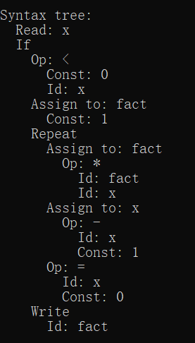
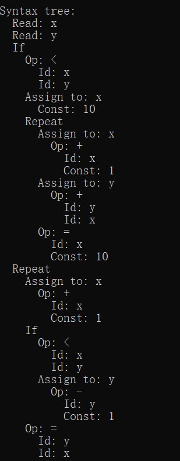

# Top-down parser for customer program language

a simple parser for a simple program language "customer language"

## "customer language" Syntax description

- A program is a sequence of statements separated by semicolons

- No procedures and no declarations

- Data Type: All variables are integer variables, and variables are declared by assigning values to them

- Statement: Two control statements: if-statement and repeat-statement, read and write statements

- Expression: Boolean and integer arithmetic expressions

- Comment: Comments are allowed within curly bracket

## The lexical structure of "CUSTOMER"

| Reserved Words      | Special Symbols |
| ----------- | ----------- |
| if then else end repeat until read write ...| + - * / = < ( )  ; := ...

## Grammer

1. program -> declarations stmt-sequence
2. declarations -> decl ; declarations |ε
3. decl -> type-specifier varlist
4. type-specifier-> int | bool | string
5. varlist -> identifier { , identifier }
6. stmt-sequence -> statement { ; statement }
7. statement -> if-stmt | repeat-stmt | assign-stmt | read-stmt | write-stmt | while-stmt
8. while-stmt -> do stmt-sequence while bool-exp
9. if-stmt -> if exp then stmt-seq end | if exp then stmt-seq else stmt-seq
end
10. repeat-stmt -> repeat stmt-sequence until exp
11. assign-stmt -> identifier:=exp
12. read-stmt -> read identifier
13. write-stmt -> write exp
14. exp -> simp-exp cop simp-exp | simp-exp
15. cop -> < | =
16. simp-exp -> simp-exp addop term |term
17. term -> term mulop factor | factor
18. factor -> (exp) |num |id
19. addop -> + | -
20. mulop -> * | /

## example

```
{sample program in TINY language- computes factorial}
read x;  { input an integer }
if 0<x then  { don’t compute if x<=0 }
	fact:=1;
	repeat
		fact := fact*x;
		x := x-1;
	until x=0;
	write fact; {output factorial of x}
end
```

```
{this is an example}
int A,B;
bool C;
string D;
D:= 'scanner';
C:=A + B;
do
A:=A*2
while A<=D
```

## Result

------
```
{A sample TINY program}
read x;
if 0<x then
fact:=1;
repeat
	fact:=fact*x;
	x:=x-1
until x=0;
write fact
end
```


--------

```
{This is Comment}
read x;{This is Comment}
read y;
if x<y then
x:=10;
repeat
	x:=x+1;
	y:=y+x
until x=10
end;

repeat
	x:=x+1;
	if x<y then
	y:=y-1
	end
until y=x
```



-------